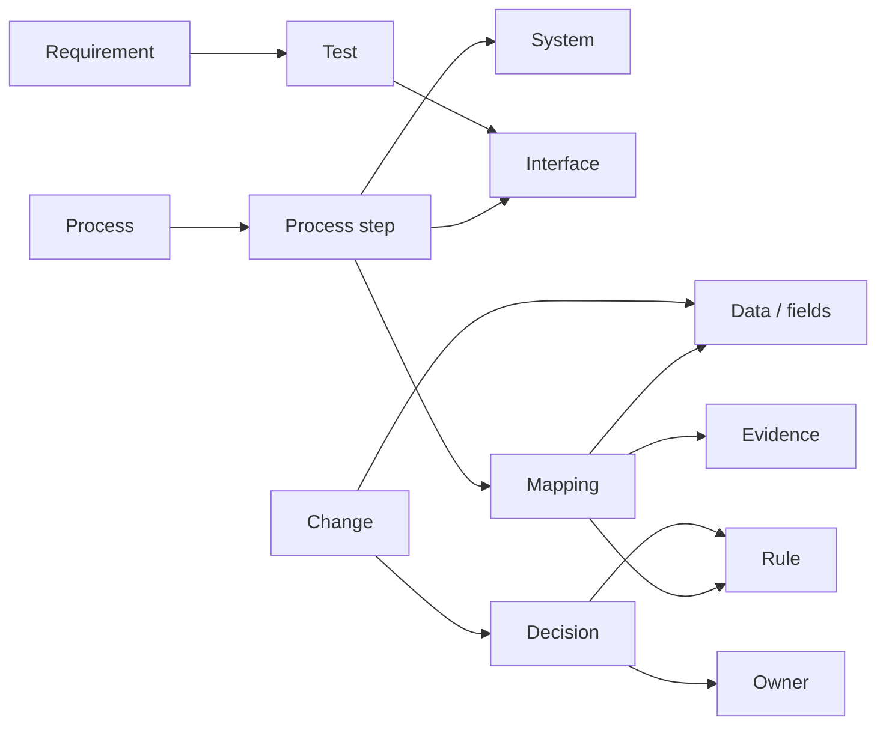

# Transformation Graph

**A Git-native connective layer for enterprise transformations.**

Transformation Graph links processes, systems, business objects, data, fields, interfaces, mappings, rules, requirements, tests, changes, decisions, owners, and evidence in one project-scoped graph.

Instead of asking people to reconstruct dependencies from PowerPoint, Excel, Jira, architecture diagrams, and tribal knowledge, the project gives those dependencies a small machine-readable representation that can be validated, queried, versioned, and handed to humans or AI agents.

## What is executable today

- canonical YAML/JSON graph model and JSON Schema
- semantic validation with dangling-reference and duplicate detection
- realistic SAP S/4HANA customer migration example
- shortest dependency-path query
- bounded context extraction for AI/automation
- impact traversal with direction/relation filters
- quality checks for orphan/coverage/evidence/ownership gaps
- Mermaid export for full or focused graph views
- pytest suite and GitHub Actions quality gate

No SAP system access is required.

## Quick start

```bash
git clone https://github.com/dkharlanau/transformation-graph.git
cd transformation-graph
python -m pip install -e ".[dev]"
transformation-graph validate examples/sap-s4-customer-migration.yaml
transformation-graph quality examples/sap-s4-customer-migration.yaml
transformation-graph impact examples/sap-s4-customer-migration.yaml change.bp-model --depth 2
```

Generate a focused Mermaid diagram:

```bash
transformation-graph mermaid examples/sap-s4-customer-migration.yaml --focus mapping.customer-to-bp --depth 1
```

## Why this exists

Enterprise transformation knowledge is usually fragmented across architecture slides, Excel mappings, Jira, process documents, test evidence, and people's heads. A field changes: which mapping uses it, which interface moves it, which test covers it, which decision created the rule, and which process is affected? Transformation Graph creates the missing cross-artifact dependency layer.

## Core model



See [docs/model.md](docs/model.md), [docs/queries.md](docs/queries.md), and [docs/quality.md](docs/quality.md).

## Agent-ready by design

The useful AI pattern is not to send the whole project to a model. Resolve the node or change in question, traverse only relevant dependencies, emit a bounded context subgraph, let the model reason over explicit relationships, and keep deterministic validation outside the model. `transformation-graph context` implements that first bounded context pattern.

## Design principles

- versionable and portable
- machine-readable and deterministic-first
- visual where useful
- Git-friendly
- vendor-neutral where practical
- interoperable with enterprise tools
- bounded context over giant document dumps

## Next

The strongest next increments are configurable policy packs, CSV/Excel import, static HTML exploration, graph diff between Git revisions, adapters for the related As Code repositories, and MCP-friendly context resources. Track sequencing in [ROADMAP.md](ROADMAP.md).

## Related projects

- [Mapping as Code](https://github.com/dkharlanau/mapping-as-code)
- [Interface as Code](https://github.com/dkharlanau/interface-as-code)
- [Reconciliation as Code](https://github.com/dkharlanau/reconciliation-as-code)
- [Process as Code](https://github.com/dkharlanau/process-as-code)
- [Enterprise Change Graph](https://github.com/dkharlanau/enterprise-change-graph)
- [Decision Tables as Code](https://github.com/dkharlanau/decision-tables-as-code)
- [Data Relationship Map](https://github.com/dkharlanau/data-relationship-map)
- [Cutover Graph](https://github.com/dkharlanau/cutover-graph)
- [Project Evidence Graph](https://github.com/dkharlanau/project-evidence-graph)

## Status

**MVP / v0.2.** The canonical model, validator, path/context/impact queries, quality checks, Mermaid export, example, tests, and CI are implemented. The model is intentionally small and expected to evolve through real transformation cases.
