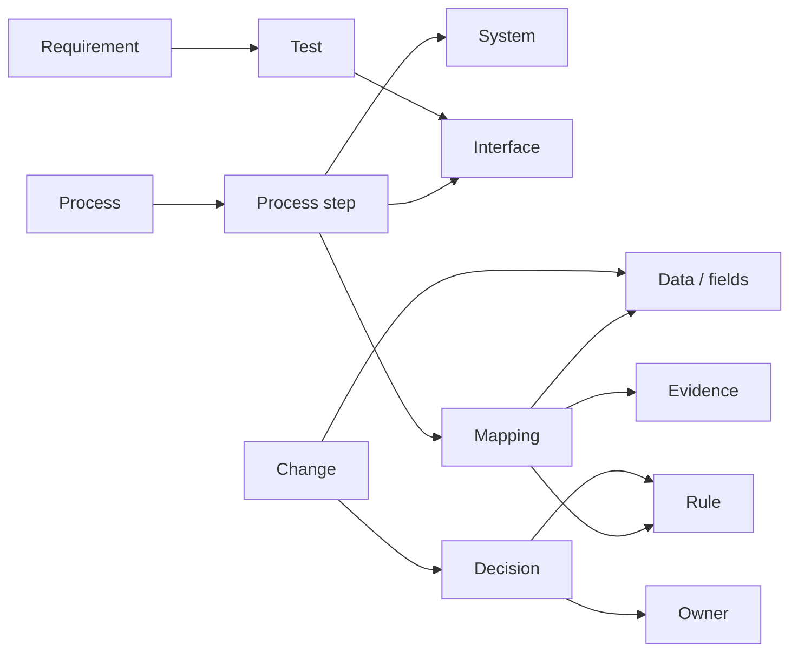

# Transformation Graph

**A Git-native connective layer for enterprise transformations.**

Transformation Graph links processes, systems, business objects, data, fields, interfaces, mappings, rules, requirements, tests, changes, decisions, owners, and evidence in one project-scoped graph.

Instead of reconstructing dependencies from PowerPoint, Excel, Jira, architecture diagrams, and tribal knowledge, the project gives those dependencies a small machine-readable representation that can be validated, queried, versioned, and handed to humans or AI agents.

## The problem

Enterprise transformation knowledge is usually fragmented. A field changes: which mapping uses it, which interface moves it, which test covers it, which decision created the rule, and which business process is affected? Transformation Graph targets that missing cross-artifact dependency layer.

## What is executable today

The repository now contains an executable v0.1 MVP:

- canonical YAML/JSON graph model
- JSON Schema
- semantic validation with dangling-reference and duplicate detection
- SAP S/4HANA customer migration example
- shortest dependency-path query
- local context extraction for AI/automation
- graph inventory/statistics
- pytest suite
- GitHub Actions quality gate

No SAP system access is required.

## Quick start

Requires Python 3.10+.

```bash
git clone https://github.com/dkharlanau/transformation-graph.git
cd transformation-graph
python -m pip install -e ".[dev]"

transformation-graph validate examples/sap-s4-customer-migration.yaml
transformation-graph stats examples/sap-s4-customer-migration.yaml
```

Find a dependency path:

```bash
transformation-graph path examples/sap-s4-customer-migration.yaml change.bp-model rule.id-conversion
```

Emit bounded machine-readable context around a mapping:

```bash
transformation-graph context examples/sap-s4-customer-migration.yaml mapping.customer-to-bp --depth 1
```

## Core model



See [docs/model.md](docs/model.md) for the canonical v0.1 model.

## Example: customer migration to SAP S/4HANA

The bundled example connects Legacy SAP ERP -> KNA1 / KUNNR -> customer-to-BP mapping -> ID conversion rule -> load interface -> SAP S/4HANA Business Partner. It also links requirement coverage, reconciliation testing, the Business Partner model change, architecture decision, owner, and mapping evidence.

Open [examples/sap-s4-customer-migration.yaml](examples/sap-s4-customer-migration.yaml).

## Why Git?

Transformation Graph is intentionally project-scoped rather than a replacement enterprise repository. Git gives the model version history, reviewable diffs, branching, pull requests, CI validation, local/offline use, portability, and predictable machine access.

## Agent-ready by design

The useful AI pattern is not to send the whole project to a model. Resolve the node or change in question, traverse only relevant dependencies, emit a bounded context subgraph, let the model reason over explicit relationships, and keep deterministic validation outside the model. `transformation-graph context` is the first implementation of that pattern.

## Repository structure

```text
schema/                         canonical JSON Schema
src/transformation_graph/       validator and query engine
examples/                       executable project graphs
docs/                           model and query documentation
tests/                          deterministic tests
.github/workflows/ci.yml        CI validation
```

## Design principles

- versionable
- portable
- machine-readable
- deterministic-first
- visual where useful
- Git-friendly
- vendor-neutral where practical
- interoperable with enterprise tools
- bounded context over giant document dumps

## Next

The strongest next increments are orphan and coverage analysis, CSV/Excel import, generated Mermaid/HTML views, graph diff between Git revisions, adapters for the related As Code repositories, and MCP-friendly context resources. Track sequencing in [ROADMAP.md](ROADMAP.md).

## Related projects

- [Mapping as Code](https://github.com/dkharlanau/mapping-as-code)
- [Interface as Code](https://github.com/dkharlanau/interface-as-code)
- [Reconciliation as Code](https://github.com/dkharlanau/reconciliation-as-code)
- [Process as Code](https://github.com/dkharlanau/process-as-code)
- [Enterprise Change Graph](https://github.com/dkharlanau/enterprise-change-graph)
- [Decision Tables as Code](https://github.com/dkharlanau/decision-tables-as-code)
- [Data Relationship Map](https://github.com/dkharlanau/data-relationship-map)
- [Cutover Graph](https://github.com/dkharlanau/cutover-graph)
- [Project Evidence Graph](https://github.com/dkharlanau/project-evidence-graph)

## Status

**MVP / v0.1.** The canonical model, validator, CLI queries, example, tests, and CI are implemented. The model is intentionally small and expected to evolve through real transformation cases.
