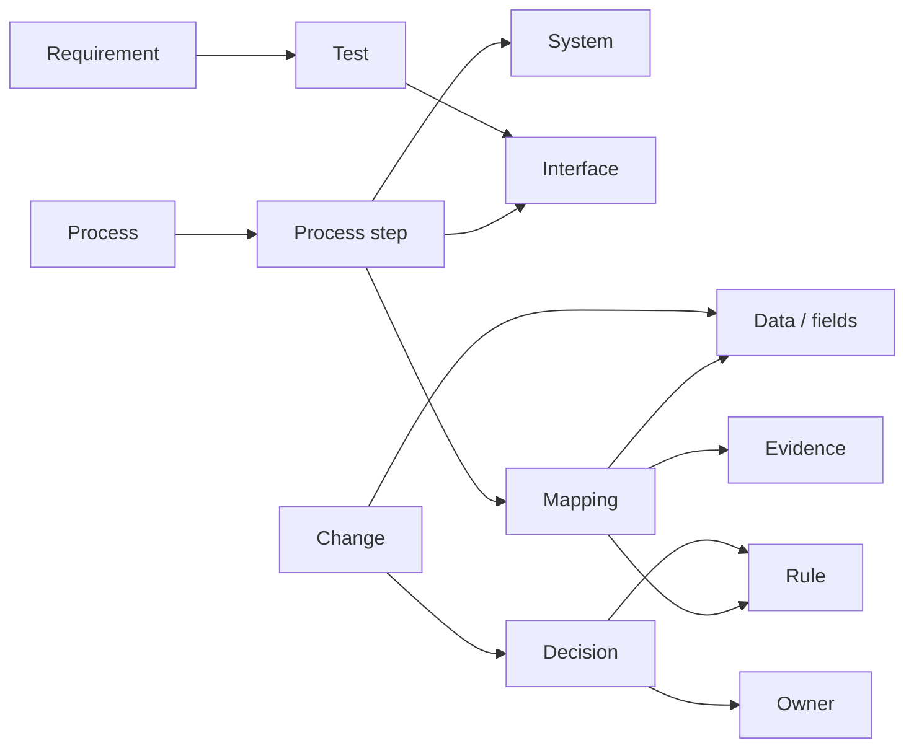

# Transformation Graph

**A Git-native connective layer for enterprise transformations.**

Transformation Graph links processes, systems, business objects, data, fields, interfaces, mappings, rules, requirements, tests, changes, decisions, owners, and evidence in one project-scoped graph.

## What is executable today

- canonical YAML/JSON graph model and JSON Schema
- deterministic semantic validation
- realistic SAP S/4HANA customer migration example
- dependency paths and bounded machine context
- impact traversal and project-quality checks
- Mermaid export
- dependency-free single-file HTML explorer
- generic CSV node/edge import
- deterministic graph composition
- semantic graph diff and neighboring change-impact
- pytest suite and GitHub Actions quality gate

No SAP system access is required.

## Quick start

```bash
git clone https://github.com/dkharlanau/transformation-graph.git
cd transformation-graph
python -m pip install -e ".[dev]"

transformation-graph validate examples/sap-s4-customer-migration.yaml
transformation-graph quality examples/sap-s4-customer-migration.yaml
transformation-graph impact examples/sap-s4-customer-migration.yaml change.bp-model --depth 2
```

Generate an offline explorer:

```bash
transformation-graph html examples/sap-s4-customer-migration.yaml --output transformation-graph.html
```

Compare snapshots:

```bash
transformation-graph diff examples/change/before.yaml examples/change/after.yaml --impact-depth 1
```

Import and compose existing inventories:

```bash
transformation-graph import-csv --nodes nodes.csv --edges edges.csv --project-id demo --project-name "Demo" --output demo.yaml
transformation-graph compose process.yaml data.yaml interfaces.yaml --project-id program --project-name "Program Graph" --output program.yaml
```

## Why this exists

Enterprise transformation knowledge is usually fragmented across architecture slides, Excel mappings, Jira, process documents, test evidence, and people's heads. A field changes: which mapping uses it, which interface moves it, which test covers it, which decision created the rule, and which process is affected? Transformation Graph creates the missing cross-artifact dependency layer.

## Core model



Documentation: [model](docs/model.md) · [queries](docs/queries.md) · [quality](docs/quality.md) · [import/composition](docs/importing.md) · [change intelligence](docs/change-intelligence.md) · [HTML explorer](docs/html-explorer.md).

## Agent-ready by design

The useful AI pattern is not to send the whole project to a model. Resolve the node or change in question, traverse only relevant dependencies, emit a bounded context subgraph, let the model reason over explicit relationships, and keep deterministic validation outside the model.

## Related projects

- [Mapping as Code](https://github.com/dkharlanau/mapping-as-code)
- [Interface as Code](https://github.com/dkharlanau/interface-as-code)
- [Reconciliation as Code](https://github.com/dkharlanau/reconciliation-as-code)
- [Process as Code](https://github.com/dkharlanau/process-as-code)
- [Enterprise Change Graph](https://github.com/dkharlanau/enterprise-change-graph)
- [Decision Tables as Code](https://github.com/dkharlanau/decision-tables-as-code)
- [Data Relationship Map](https://github.com/dkharlanau/data-relationship-map)
- [Cutover Graph](https://github.com/dkharlanau/cutover-graph)
- [Project Evidence Graph](https://github.com/dkharlanau/project-evidence-graph)

## Status

**Executable MVP / v0.5.** The repository now supports authoring, validation, query, import, composition, visualization, quality analysis, and semantic change review.
